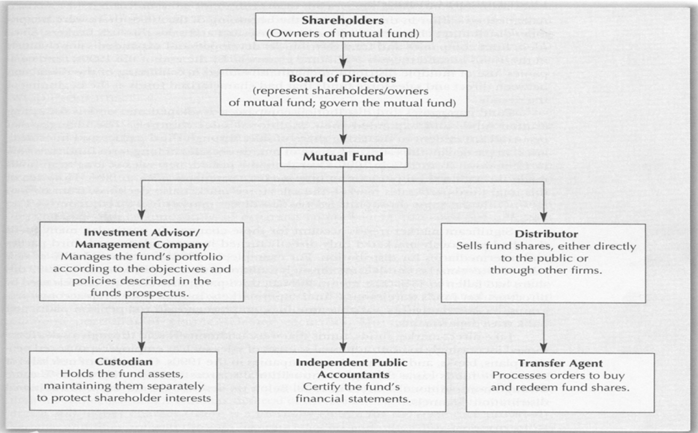
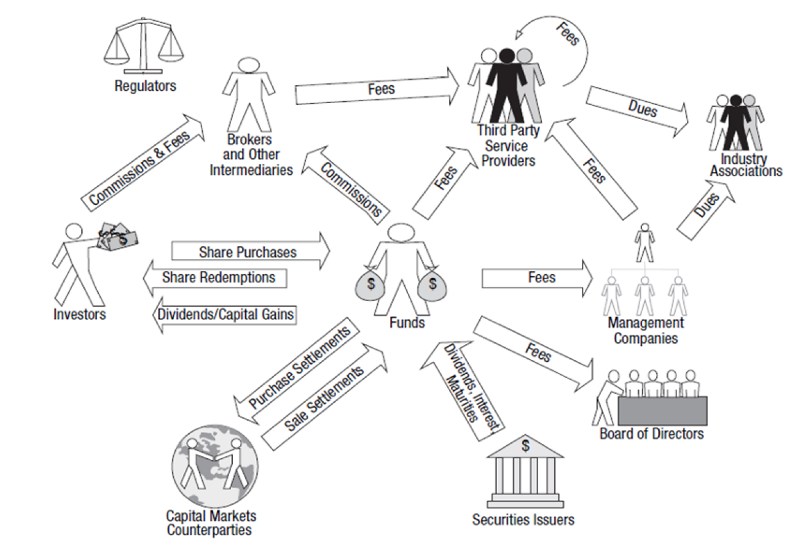

# Mutual Fund Review

[TOC]

## 1 基金基础

### 1.1 定义

基金是一种**利益共享、风险共担**的集合证券投资方式 。

> 通过发行基金单位，集中投资者的资金，由托管人托管，由基金管理人管理和运用资金，从事股票、债券等金融工具投资，并将投资收益按基金投资者的投资比例进行分配。

### 1.2 优势

- 专业化管理：基金公司聘有专业基金经理人及研究团队从事市场研究，花少许的管理费可享受到专家服务
- 成本低：规模经济
- 分散投资风险：将资金分散於不同的股票、甚至不同的投资工具中，以达到真正的风险分散
- 流动性：共同基金能确保每一位持有人在任何时候，变现其所持有的基金份额
- 便捷性：共同基金易于买卖，既可直接通过基金家族进行，也可通过经纪人等中介机构办理，为不同投资偏好的投资者提供了广泛的选择
- 安全性：监管规范，采取**资金的保管与经营分开**的原则

### 1.3 分类

#### 1.3.1 按规模是否固定分

- 开放式：投资者可以随时向基金管理人或其代理销售机构申购或赎回，规模可变
- 封闭式：基金规模在发行完毕后和规定的期限内固定不变

差异：

- 存续期限不同：封闭式基金有明确的存续期限开放式基金无明确存续期限
- 规模可变性不同：封闭式基金规模固定不变，开放式基金所发行的基金份额是可赎回的，而且投资者在基金的存续期间内也可随意申购基金份额,导致基金的资金总额每日均不断地变化，始终处于"开放"的状态。这是封闭式基金与开放式基金的根本差别
- 交易方式不同：封闭式基金发起设立时，投资者可以向基金管理人或销售机构认购，当封闭式基金上市交易时,投资者又可在证券交易所按市价买卖。而投资者投资于开放式基金时，则可以随时向基金管理人或代理销售机构申购或赎回
- 可赎回性不同：封闭式基金在存续期限内不可赎回；开放式基金所发行的基金份额是可赎回的
- 交易价格计算标准不同：封闭式基金因在交易所上市，其买卖价格受市场供求关系影响较大；开放式基金的买卖价格是以单位基金资产净值为基础计算的，可直接反映基金份额资产净值的高低

#### 1.3.2 按照组织形式分为

- 公司型基金
- 契约型基金

#### 1.3.3 按照募集与流通方式分

- 公募基金
- 私募基金：在出资人间建立了完备的契约合同的民间私下合伙投资

#### 1.3.4 按照国别分

- 在岸基金：本国募集资金并投资于本国市场
- 离岸基金：他国募集资金投资于本国或第三国市场

#### 1.3.5 按照投资证券类型分

- 股票基金 
- 债券基金 
- 货币市场基金 
- 混合型基金
- 衍生证券投资基金

#### 1.3.6 按照投资风格分

- 成长型基金 
- 收入型基金 
- 平衡型基金 

#### 1.3.7 例子

- 伞形基金(Umbrella Fund)
  - 是开放式基金的一种组织结构。基金发起人根据一份总的基金招募书发起设立多只相互之间可以根据规定的程序进行转换的基金，这些基金称为子基金或成分基金。而由这些子基金共同构成的这一基金体系就合称为伞型基金
  - 伞型基金不是一只具体的基金，而是同一基金发起人对由其发起、管理的多只基金的一种经营管理方式
- 基金中的基金(FoF)
  - 不直接投资股票或债券，其投资范围仅限于其他基金，通过持有其他证券投资基金而间接持有股票、债券等证券资产，它是结合基金产品创新和销售渠道创新的基金新品种
- 保本基金(Capital Guarantee Fund)
  - 在定投资期限内，对投资者所投资的本金提供一定比例保证的基金  
  - 将大部分资金投资于定息工具（如货币市场、债券），主要承担保本作用；将其它少部分资金投资于高风险高收益的股票、期货、期权及其它衍生工具，以期获取较高的收益率，即使风险资产全部损失，投资于债券的资金仍可满足投资者的保本要求  
- 交易型开放式指数基金(ETF)
  - 一种跟踪“标的指数”变化、且在证券交易所上市交易的基金  

### 1.4 行业结构

- Font Office
- Middle Office
  - Information Technology
  - Risk Management
  - Compliance
- Back Office
  - Clearing & Settlement
  - Accounting/Valuation/Reporting
  - Transfer Agency

Structure of FMC 

Workflow of FMCs 

**Broker**: 经纪人，它是通过为客户提供经纪服务来赚取交易佣金的方式获利的。它本身是不参与到交易中的，仅仅起到一个中介的作用（代客交易），它是不具有所买卖财产的所有权的

**Dealer**: 做市商，它的获利方式是用自有资金来买入证券，然后再以更高的价格卖给投资者，来赚取买卖价差。它会参与到整个交易过程中，是完全拥有所买卖的财产的所有权的

**参与者功能**

- 托管行是指负责保管、持有基金管理公司等投资机构从客户处募集到的资金，并对基金管理人使用这笔资金进行监管和对外披露信息的机构，通常由商业银行来担当
  - 安全保管基金资产
  - 执行基金管理人的划款及清算命令
  - 监督基金管理人的投资运作
  - 复核、审查基金管理人计算的基金资产净值和基金价格
- 董事要确保基金的服务提供机构特别是管理公司为基金持有人的最大利益尽职尽责
- 基金管理公司管理公司一般都要提供或者监督全部核心的服务
- 第三方服务提供商因法规（如托管、审计），或者规模经济的考虑，管理公司将一些服务转包给外部服务商

**托管服务**

基金托管是指商业银行接受基金管理人的委托，代表基金持有人的利益，保管基金资产，监督基金管理人日常投资运作，基金托管人独立开设基金资产账户，依据管理人的指令进行清算和交割，在有关制度和基金契约规定的范围内对基金业务运作进行监督，并收取一定的托管费。

### 1.5 基金净值计算

Net Asset Value(NAV): 
$$
\begin{equation}\begin{split}
基金净值&=\frac{基金总资产–基金总负债}{发行在外的基金份额总数} \\
基金累计净值&＝基金净值＋基金成立后份额的累计分红金额
\end{split}\end{equation}
$$

### 1.6 费用结构

- 前端负载：预付费用
- 后端负载：赎回时基金公司收取费用
- 无负载资金：发行价等于资产净值

## 2 基金招股说明书

共同基金招股说明书解释了基金如何运作，多年来的表现以及您购买和持有股票的费用。

1. 摘要说明书
2. 法定招股说明书
3. 附加信息声明

两种招股说明书都包含重要信息：投资目的、策略、风险、费用和支出、过去的表现、基金投资顾问和投资组合经理的信息，以及有关如何购买和赎回股票的详细信息。

## 3 财务报表

资产=负债+股东权益

- Balance Sheet资产负债表
- Cash Flow Statement现金流表
- Income Statement收入证明
- Earnings/Retained Earnings
- Return on Investment(ROI)    $投资回报率=\frac{投资收益}{投资成本}$
- Price/Earning Ratio(PE Ratio)    $价格收益比=\frac{当前股价}{每股收益的估值}$
- Earning Per Share(EPS) $每股盈余=\frac{盈余}{总股本}$

## 4 共同基金评级

### 4.1 投资回报

#### 4.1.1 货币时间价值

Cash Flow: 现金流

- Future Value(FV): 终值

- Present Value(PV): 现值

$$
\begin{equation}\begin{split}
FV&=PV(1+i)^n \\
PV&=\frac{PMT}{i} \\
periodic\;rate&=\frac{nominal\;rate}{m} \\
EAR&=(1+periodic\;rate)^m-1 \\
&\text{where m is the number of compounding periods per year}
\end{split}\end{equation}
$$

**72定律**：$Approx. \text{Years to Double} = \frac{72}{i\times 100} $

#### 4.1.2 投资回报计算

Money weighted return: 投资组合的内部收益率，同时考虑到所有现金流入和流出

1. 计算每个时间点的总cash flow，inflow为正，outflow为负
2. 使用公式$PV_{outflow}=PV_{inflow}$
   - 每个时间点PV的计算：$PV_i=\frac{FV}{(1+r)^i}$
3. 解方程得到收益率

Time weighted return: 复合增长率

1. 将估值阶段分为几个子阶段Holding periods，确定每个子阶段的初值、终值、红利
2. 计算每个阶段的HPR(Holding Period Rate)
   - $HPR=\frac{end\;price + dividend}{begin\;price}-1$
3. 计算收益率：$(1+r_{\text{time weighted}})^n=(1+HPR_1)\times\cdots(1+HPR_n)$

区别：时间加权汇报是衡量绩效的首选方法，不受现金流入流出时间的影响；如果基金经理对现金流的时间有自由裁量权，则应根据货币加权回报率评估业绩。

### 4.2 主动基金 vs. 被动基金

主动型基金：资金募集后有基金经理操盘，把资金投资于他看中的股票，债券等，以期获得超越市场基准的收益

被动型基金：资金募集后按比例投入到相应的股票、债券等

| 区别         | 主动型基金                                                   | 被动型基金                                         |
| ------------ | ------------------------------------------------------------ | -------------------------------------------------- |
| 投资理念     | 不刻意去做指数化投资，以超越市场基准为目标                   | 不主动去寻求超越市场的表现，而是试图复制指数的表现 |
| 评价标准     | 大多追求相对收益，评价主动型基金的表现主要看产品业绩是否跑赢了业绩比较基准以及在同类产品中的排名 | 被动型产品与所追踪指数的拟合程度                   |
| 业绩影响因素 | 受基金经理个人风格影响比较显著                               | 受市场表现影响较大                                 |
| 费率         | 费率更高                                                     | 成本较低                                           |

### 4.3 共同基金评级

第三方机构发布，仅仅是评价过去表现以供未来参考，一般是3年期、5年期、10年期。

- Morning star: 依赖于单一衡量标准——计算风险调整的收益
- Lipper: 多种衡量指标

评级步骤：

1. 分类
2. 计算risk adjusted return
3. 排序

## 5 金融工具

### 5.1 分类

- 传统资产：普通股(Common Stock)、债券(Bonds)
- 可选资产：对冲基金(Hedge Fund)、私募股权基金(Private Equity Fund)、风险投资(Venture Capital)、房地产(Real Estate)
- 衍生品：远期(Forward)，期货(Future)，期权(Option)，互换(Swap)
- 外币(Foreign Currency)、国际证券(International Securities)、共同基金(Mutual Fund)、交易所交易基金(ETF)

### 5.2 股票

股票是一种有价证券，是股份公司在筹集资本时向出资人发行的股份凭证。

- 普通股：代表资产所有权的担保，有权参与股息，对重大事项进行投票
- 优先股：代表公司股份的股权，可以获得定期固定股息，股息可以支付给普通股股东【权力以股票形式存在，类似于债券；拥有优先于普通股的索偿权：先还债券->优先股->普通股】

股票类型

- Class A: 普通股
- Class B: 比A类股票具有更多的投票权

同股不同权，把投票权和股份分开，防止创始人股份被稀释，保证控股。

股票交易市场

- IPO: 首次发行市场
- Secondary Market: 二级市场，主要市场
- Exchanges: 交易所交易
- OTC: 场外交易

### 5.3 债券

债券是指在特定日期支付特定金额的承诺。 它也被描述为借款人支付利息和偿还借款资金本金的合同义务。

#### 5.3.1 债券特性

- Coupon rate: 票面利率
- Dated date: 发行日期
- Maturity: 到期日
- Par Amount: 面值
- Coupon: 优惠券
- Yield: 收益
- Yield to Maturity: 到期收益率

#### 5.3.2 债券发行人

- 公司债券
- 市政债券
- 政府债券（国债）
- 资产支持证券（ABS）
- 非市场政府债券： EE, HH, I

#### 5.3.3 债券价格/利率关系

票面利率越高，债券价格越高；市场利率越高（银行），债券价格越低（持有人），债券收益率越高（买入者）

### 5.4 衍生品

#### 5.4.1 分类

- Forward: 远期合约和期货合约都是交易双方约定在未来某一特定时间、以某一特定价格、买卖某一特定数量和质量资产的交易形式
- Future:  期货合约是一种有组织的交易所的标准化协议，可以在将来的某个日期以固定价格买卖货币对。 合同是可交换的，因此更具流动性
- Option: 期权交易是买卖权利的交易。期权合约规定了在某一特定时间、以某一特定价格买卖某一特定种类、数量、质量原生资产的权利。买卖不是必需的
- SWAP: 是当事人之间签讨的在未来某一期间内相互交换他们认为具有相等经济价值的现金流的合约

#### 5.4.2 衍生品特点：

- 零和游戏: 交易双方盈亏完全负相关，净损益为零  
- 高杠杆: 不确定，高风险，保证金越低，杠杆效应越大
- 保证金交易：指证券交易的当事人在买卖证券时，只向证券公司交付一定的保证金，或者只向证券公司交付一定的证券，而由证券公司提供融资或者融券进行交易。

#### 5.4.3 衍生品参与者

- Hedgers: 对冲者采用衍生产品合约来减少自身面临的由于市场变化而产生的风险
- Speculators: 投机者利用这些产品对今后市场变量的走向下赌注
- Arbitragers: 套利者采用两个或更多相互抵消的交易来锁定盈利

投资目的

- 价格决定，对冲风险，价格决定，对冲风险，降低成本，提高产量，管理资产负债，流动性，分散利率风险，保险

#### 5.4.4 Underlying Asset

证券，黄金，白银，大宗商品，货币汇率

#### 5.4.5 权证/期权

期权与权证都是一种选择权。在支付一定的权利金后，给予持有者按照合约内容，在规定的期间内或特定的到期日，按约定价格买入或卖出标的资产的权利。是持有者一种权利（但没有义务）的证明。

- 发行主体不同。期权没有发行人，每一位市场参与人在有足够保证金的前提下都可以是期权的卖方。期权交易是不同投资者之间的交易。当投资者买入某公司的认购期权时，卖出期权的是普通投资者。而权证通常是由标的证券上市公司、投资银行（证券公司）或大股东等第三方发行的。交易双方为股票权证的发行人与持有人

- 交易方式不同，期权交易比权证更灵活。投资者可以买入或卖出认购期权，也可以买入或者卖出认沽期权。但对于权证，普通投资者只能买入权证，只有发行人才可以卖出权证收取权利金。当然投资者也可以在二级市场交易手中已有的权证

- 合约特点不同，期权合约中的行权价格、标的物和到期时间等都是由市场统一规定好的，而权证合约中的行权价格、标的物、到期时间等都是由发行者决定的

- 合约供给量不同。期权在理论上供给无限，不断交易就不断产生。而权证的供给有限，由发行人确定

- 行权后效果不同。认购期权或认沽期权的行权，仅是标的证券在不同投资者之间的相互转移，不影响上市公司的实际流通总股本数；对于上市公司发行的股本权证，当投资者对持有的认购权证行权时，发行人必须按照约定的股份数增发新的股票，从而导致公司的实际流通总股本数增加

### 5.5 可选投资

往往比传统资产风险更大，同时也带来高回报。

#### 5.5.1 对冲基金

主要目标是通过涉及期权，卖空和杠杆的策略获得最大的回报率。 另一方面，因为他们经常使用期货，掉期和套利策略，你可以说对冲基金分散了股市的一些投资风险。 

#### 5.5.2 私募股权基金

私募股权通常缺乏流动性，被视为长期投资。它们不在交易所上市，任何希望在私人公司出售证券的投资者必须在没有市场的情况下找到买主。   

#### 5.5.3 风险投资

资金和资源用于具有特殊增长潜力的创业公司和小型企业。   

#### 5.5.4 房地产

房地产投资信托基金是一种通过房地产或抵押贷款投资于房地产的证券，通常在股票等主要交易所进行交易。 房地产投资信托基金为投资者提供了极为流动的房地产股权。 他们受到特殊的税收考虑，通常提供高股息收益率。

## 6 证券交易

### 6.1 命令类型

#### 6.1.1 Limit risks

- Basket: 一组单独的订单，保存在单个文件中，并作为打包提交，分散了风险
- Stop: 一种当买方出价或卖方要价抵达预定价位时自动清仓的指令  
- Stop Limit: 此种委托单结合了限价买单 以及限价卖单二种形式。当股票达到一特定价格时，限价停损委托单便被使用  

#### 6.1.2 Speed of Execution 

- Market: 市场订单是按照市场上当前可用的买入或卖出价买卖资产的订单

- Market If Touched: 指市场价格只要触及客户所规定的价格水平时就生效的指令。也就是说，一旦市场价格到达了客户所事先设定的价格，这份指令就成为市价指令，这时经纪人就可以争取以最佳的价格为客户达成交易

- Market On Open: 在市场打开时以市场价格执行的市场定单

- Market On Close:  在市场关闭时以市场价格执行的市场定单

- Pegged to Market: 被定为以最佳报价购买并以最佳出价出售的订单
- VWAP

#### 6.1.3 Price Improvement 

- Limit: 以指定价格或更高价格买卖合约的订单
- Limit If Touched: 定单以指定限价或更好价格买入（或卖出）低于（或高于）市场价格的资产。 这种定单一直被持有在系统中，直到触发价格被触及，然后作为限价定单被提交

#### 6.1.4 Discretion

- Discretionary: 一种限价定单，您对其定义一个任意的金额（将被添加到限价中或从限价中扣减），该金额会增大定单能够执行的价格范围。最初的限价被显示给市场
- Hidden: 在市场数据或深层账本中均未显示其存在的证据
- Iceberg: 允许提交订单而仅公开披露所提交订单的一部分

#### 6.1.5 Market Timing

- All or None: 使用全或无属性的定单，只有当整个数量在特定的价格或更好价格可用时才将被执行
- Fill or Kill: 将有效时间设置为全数执行或立刻取消，规定整个定单必须立刻执行或者被取消
- GTD: 有效时间让指定一个到期日期和时间，直到这之前定单都将继续工作
- GTC: 使用取消前有效作为有效时间的定单，将继续工作直到定单执行或被取消
- IOC: 应用于定单的立刻执行或取消，有效时间命令定单任何未立刻执行的部分将被取消

### 6.2 股票分析

#### 6.2.1 基本面分析

Buying a bussiness，对公司估值，与市场价格对比。

#### 6.2.2 技术分析

Buying the numbers，只看价格，价格反映一切，价格变动具有趋势，历史会重演。

## 7 其他问题

### 7.1 资本市场/外汇市场/货币市场特征

- 资本市场又称长期资金市场，是以期限在1年以上的金融工具为媒介进行长期性资金交易活动的市场。
  - 交易期限较长。少则—年，长则数十年
  - 交易目的主要为解决长期资本需求
  - 资金借贷量大。市场交易工具特殊
  - 具有一定的风险性和投机性，高风险高收益

- 货币市场是指以期限在1年以内的金融工具为媒介进行短期资金融通的市场。从交易对象的角度看，货币市场主要由同业拆借、票据、国库券以及回购协议等子市场组成
  - 交易期限短，一般在3~6个月交易的主要目的是解决短期资金周转的需要
  - 流动性强
  - 低风险低收益
  - 交易量大
- 外汇市场指的是以外国货币表示的，为各国普遍接受的，可用于国际间债权债务结算的各种支付手段。
  - 可支付性(必须以外国货币表示的资产)
  - 可获得性(必须是在国外能够得到补偿的债权)
  - 可换性(必须是可以自由兑换为其他支付手段的外币资产)
  - 有市无场，循环作业，零和游戏

### 7.2 Risk/VaR

在险价值指在市场正常波动下，某一金融资产或证券组合的最大可能损失。更为确切的是指，在一定概率水平（置信度）下，某一金融资产或证券组合价值在未来特定时期内的最大可能损失。

$P(ΔPΔt≤VaR)=a$

- P——资产价值损失小于可能损失上限的概率，即英文的Probability

- ΔP——某一金融资产在一定持有期Δt的价值损失额

- VaR——给定置信水平a下的在险价值，即可能的损失上限

- a——给定的置信水平

VaR从统计的意义上讲，本身是个数字，是指面临“正常”的市场波动时“处于风险状态的价值”。即在给定的置信水平和一定的持有期限内，预期的最大损失量(可以是绝对值，也可以是相对值)。例如，某一投资公司持有的证券组合在未来24小时内，置信度为95%，在证券市场正常波动的情况下，VaR值为520万元，其含义是指，该公司的证券组合在一天内(24小时)，由于市场价格变化而带来的最大损失超过520万元的概率为5%，平均20个交易日才可能出现一次这种情况。或者说有95%的把握判断该投资公司在下一个交易日内的损失在520万元以内。5%的几率反映了金融资产管理者的风险厌恶程度，可根据不同的投资者对风险的偏好程度和承受能力来确定。

### 7.3 DTCC

美国存管信托和结算公司（DTCC）是一家为金融市场提供清算和结算服务的美国后贸易金融服务公司。它以买卖双方的名义进行证券交易，并通过提供中央证券托管，发挥中央证券存管机构的职能。

- 集中保管：把所有的实体证券全部集中在同一个地方进行保管，所有的交易、交割或股权转移变更，都是划拨转帐的方式进行

- 集中交割，在市场上成立一家公司，由它来担任所有证券交易的对手方，然后将所有交易者的买卖部位进行多边冲销，最后再以冲销后的净额进行结算交割

服务功能：

- 清算和结算
- 资产服务
- 全球公司行为：集中提供公司行为的有效信息来源
- 场外交易衍生品：自动化对比和确认服务
- 财富管理服务
- 保险服务